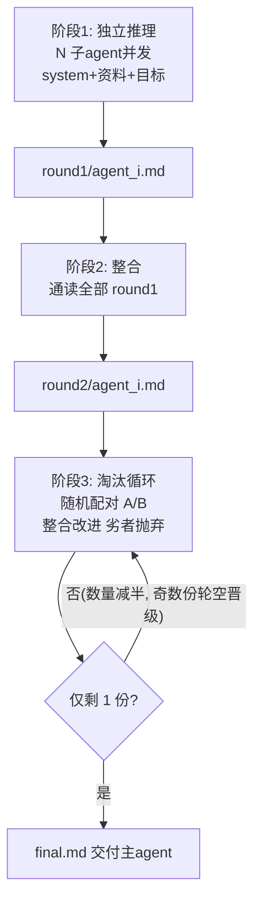
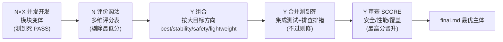

# Accel-Skill

> 极限压榨模型性能 — 多子代理并发流水线技能包，把每一次 API 调用压到极限价值。

[](LICENSE)
[]()
[]()
[]()
[]()
[]()
[]()

两个开箱即用的 agent 技能，**单文件纯标准库、零依赖、0-256 并发**，主 agent 一个命令即可调度整条流水线：

| 技能 | 一句话 | 核心 |
|---|---|---|
| **Trial** | 大任务前多子代理并发头脑风暴 | 多并发 + 文件权威 → 唯一收敛方案 |
| **Booster** | 任务拆分模块化并发工程 | N×X 并发 + 测到死验收 → 最优合并主体 |

---

## 快速开始（一键复制）

```bash
# 方式一：git clone（推荐，含 README/协议）
git clone --depth 1 https://github.com/Xiyinnnnnn/Accel-Skill.git ~/skills

# 方式二：单文件直取（只要宿主，不需要协议）
mkdir -p ~/skills/{Trial,Booster}
curl -fsSL https://raw.githubusercontent.com/Xiyinnnnnn/Accel-Skill/main/Trial/trial.py    -o ~/skills/Trial/trial.py
curl -fsSL https://raw.githubusercontent.com/Xiyinnnnnn/Accel-Skill/main/Trial/Accel-Skill-Trial-skill.md    -o ~/skills/Trial/Accel-Skill-Trial-skill.md
curl -fsSL https://raw.githubusercontent.com/Xiyinnnnnn/Accel-Skill/main/Booster/booster.py -o ~/skills/Booster/booster.py
curl -fsSL https://raw.githubusercontent.com/Xiyinnnnnn/Accel-Skill/main/Booster/Accel-Skill-Booster-skill.md   -o ~/skills/Booster/Accel-Skill-Booster-skill.md
```

# 方式三：DeepSeek Harness 插件（一键载入）

```bash
npx @deepseek-ai/dsh plugin --profile web add dsh-accel-skill
```

载入后模型获得 `accel_trial` / `accel_booster` 两个工具，参数与上方 CLI 一一对应；key 走 DSH 进程环境（`DEEPSEEK_API_KEY` 或插件 config.key），不进入模型上下文。源码适配层位于仓库 `dsh/`（Cordis 插件，纯 ESM 零构建），npm 包名 `dsh-accel-skill`。

部署后 3 秒上手：

```bash
# 零成本自测（mock 模式，不联网不耗 key，工具链真实执行）
python3 ~/skills/Trial/trial.py     --docs 资料目录 --work 工作目录 --goals "A|B" --mock
python3 ~/skills/Booster/booster.py --docs 资料目录 --work 工作目录 --modules N --per-module X --goal "大目标" --mock

# 真实调用（key/端点/模型由使用方提供，仅进程内不落盘）
export TRIAL_API_URL="https://你的端点/v1/chat/completions" TRIAL_MODEL="你的模型"
python3 ~/skills/Trial/trial.py --docs 资料 --work 工作 --goals "A|B" --key <key>
```

> 每个技能目录内自带 `skill.md`（agent 友好重型文档：调用时机/用法/权限/边界/维护），主 agent 读它即可驱动。

---

## 主循环模式

### Trial — 头脑风暴收敛循环



**文件权威**：子 agent 一切结论必须 `write_md` 落盘，无 md = 无产出 = 失败；被淘汰方案留在原轮次（证据链），剔除 = 下一轮不引用。

### Booster — 模块化工程流水线



**测到死**：每模块变体必须含 PASS 验收标记且无 FAIL/ERROR/NOT PASS 才参与组合；合并同理；审查必须 SCORE 可解析——程序层强制，一项不过不进入交付。

---

## 预期性能提升

| 维度 | 单 agent 单轮 | Trial | Booster |
|---|---|---|---|
| 方案多样性 | 1 | N 个并发独立推理 | N×X 个模块变体 |
| 收敛能力 | 无（各说各话） | 减半淘汰 → **唯一方案** | 组合+审查 → **最优主体** |
| 质量过滤 | 无 | 配对整合弃劣 | 多维评分 + 测到死验收 |
| 决策依据 | 单点直觉 | 文件权威 + 多源整合 | 安全/性能/覆盖多角度审查 |
| 并发利用率 | 单线程 | 0-256 线程全并行 | 0-256 线程全并行 |

一句话：**同样的模型，从"一次想一个"变成"一群想、择优收敛"**——多样性靠并发，收敛靠淘汰，质量靠验收。

## 成本开销（完全可预测）

子 agent 调用次数为**固定公式**，无隐藏开销：

| 模式 | 调用数公式 | 示例 | 产出 |
|---|---|---|---|
| 单 agent 单轮 | 1 | 1 次 | 1 个想法 |
| Trial | 2N + 减半轮次 | N=3 → **8 次** | 1 个收敛方案 |
| Booster | N×X + N + 2Y | N=2,X=3,Y=4 → **16 次** | 1 个最优合并主体 |

- **线性可控**：调用数随参数线性增长，无指数爆炸；Trial 阶段3逐轮减半，Booster 每阶段独立计费
- **零成本验证**：`--mock` 模式模拟 LLM 决策、工具链真实执行，全流程先验证再上真 key
- **key 零泄露**：仅进程内使用，不落盘；端点/模型走环境变量或参数

---

## 技术底座

- **超轻量**：单文件纯标准库（无第三方依赖），`#!/usr/bin/env python3` 直接跑
- **安全**：realpath 路径校验（读限资料/工作目录、写限工作目录）、覆盖他人产出拒绝、危险操作全由宿主管理；shell 路径越权检查覆盖绝对路径与 ~/$HOME/${VAR}（展开后校验），系统路径白名单 /usr/ /bin/ /sbin/ /lib /etc/，/proc/ /dev/ /sys/ 不放行
- **重型 prompt**：子 agent SYSTEM 写死（ROLE/IDENTITY/BOUNDARY/THINK/MUST/EXAMPLE/RULES），工具 schema 写死（list_dir/read_file/write_md）
- **agent 友好**：`--json` 结构化输出、退出码语义化、目标三来源；单子代理工具轮次默认无限（设计），真调用可用 `--max-turns` 兜底

## 协议

[MIT](LICENSE) © 2026 Xiyinnnnnn — 自由使用、修改、分发。
